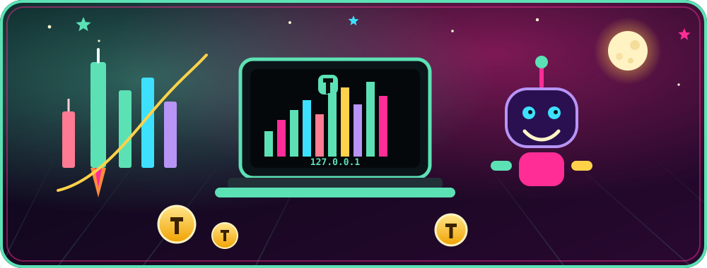
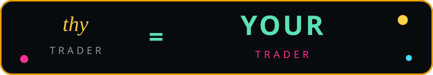
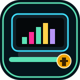

<p align="center">
  
</p>

<h1 align="center">ThyTrader</h1>

<p align="center">
  
</p>

<p align="center">
  
</p>

<p align="center"><strong>This is not just another trading UI.</strong></p>

<p align="center">
  You research.<br>
  You write <em>your</em> strategies.<br>
  You automate trades <strong>on your own device</strong>.<br>
  An agent can drive ThyTrader <strong>100%</strong> — or you never let go of the mouse.
</p>

<p align="center">
  Thine stack. Thy keys. Thy agent.<br>
  <sub>Coinbase Advanced Trade spot, local-first. Other exchanges later.</sub>
</p>

<table>
  <tr>
    <td align="center" width="25%">
      <br>
      <strong>YOUR trader</strong><br>
      <sub><em>thy</em> is old English for <strong>your</strong>. That's the whole product.</sub>
    </td>
    <td align="center" width="25%">
      <br>
      <strong>On your device</strong><br>
      <sub>Loopback. Your metal. No rented dashboard in the cloud.</sub>
    </td>
    <td align="center" width="25%">
      <br>
      <strong>Agent = 100%</strong><br>
      <sub>An authorized agent can run the entire loop. Humans still can too.</sub>
    </td>
    <td align="center" width="25%">
      <br>
      <strong>Research → automate</strong><br>
      <sub>You author it. You test it. Then it runs. Same published strategy.</sub>
    </td>
  </tr>
</table>

<p align="center">
  Mutations stay gated (<code>--confirm</code>; live also <code>--i-understand-live</code>).<br>
  Missing candles are never interpolated. Secrets never print.
</p>

<p align="center"></p>

## Fire it up (loopback only)

Needs Docker Compose and [`uv`](https://docs.astral.sh/uv). Host ports bind to **127.0.0.1**.

```bash
git clone https://github.com/Zoltesh/thytrader.git
cd thytrader
make run
```

| Dashboard | API | Postgres |
|---|---|---|
| http://127.0.0.1:5175 | http://127.0.0.1:8200/health/ready | `127.0.0.1:5439` (loopback only) |

`make run` does **not** print secrets or connection URLs.

```bash
make status   # service health
make logs     # follow API, workers, and web
make down     # tear down Compose (keeps database + market-data volumes; make stop is a synonym)
```

Deep setup, credentials (names only), native processes: **[docs/user/setup.md](docs/user/setup.md)**

## User guide

| | |
|---|---|
|  **[Start here](docs/README.md)** | What it is, why it's yours |
|  **[Setup](docs/user/setup.md)** | Clone-and-run, loopback, Compose, `.env` names |
|  **[Safety](docs/user/safety.md)** | Secrets, live arming, confirmation gates |
|  **[Operate](docs/user/operate.md)** | Browser **and/or** agent, paper vs live |

<p align="center"><sub>Art in <a href="docs/assets/">docs/assets/</a> is original ThyTrader work — no venue marks, no scraped logos.</sub></p>
