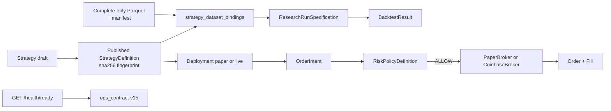

# Contract diagrams

These Mermaid pages diagram **shipped** contracts and schemas. They are contributor
documentation. They are not the landing README and they are not a substitute for the
typed models.

Source of truth is the Python models plus the architecture pages linked below. If a
diagram and a model disagree, the model and its tests win; repair the diagram in the
same change that changes the contract.

| Diagram | Contract | Models |
|---|---|---|
| [Strategy schema](strategy.md) | Canonical published strategy document | `thytrader.strategies.models.StrategyDefinition` |
| [Research-run spec](research-run.md) | Immutable research request | `thytrader.research.models.ResearchRunSpecification` |
| [Backtest result](backtest-result.md) | Immutable simulation evidence | `thytrader.backtest.models.BacktestResult` |
| [Ops contract](ops-contract.md) | CLI versus running-image identity | `thytrader.ops_contract`, `OpsContractPayload` |
| [Order intent → risk → broker](execution.md) | Paper/live execution boundary | `OrderIntent`, `RiskPolicyDefinition`, brokers |
| [Other durable payloads](other-payloads.md) | Dataset manifest, risk policy, operator envelope, memory hooks | `DatasetManifest`, `RiskPolicyDefinition`, `OperatorEnvelope`, `JournalEntry` |

Do not dump these diagrams on [docs/README.md](../../README.md).
