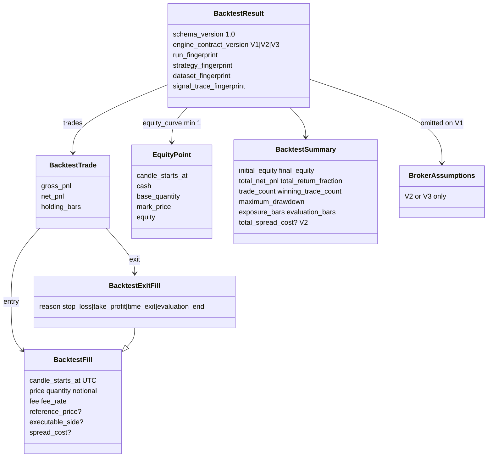
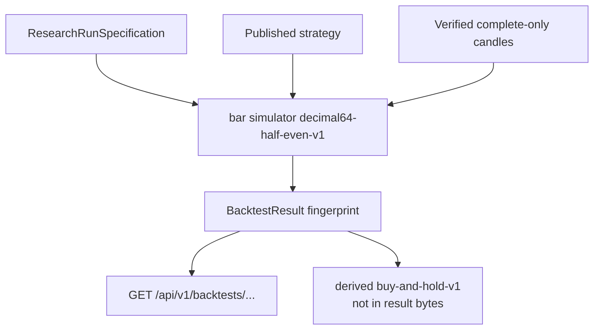

# Backtest result

Immutable simulation evidence for one research-run. Not order authority.
Field rules: [backtest simulation](../backtest-simulation.md).
Model: `thytrader.backtest.models.BacktestResult`.

Canonical result JSON is sorted compact UTF-8. Its SHA-256 fingerprint is the
result identity. Append-only PostgreSQL `published_backtest_results`. Load
reverifies bytes, fingerprint, row identity, and the source run. Buy-and-hold
comparison is a **derived** `thytrader-buy-and-hold-v1` report. Sharpe-class
ratios are a **derived** `thytrader-performance-metrics-v1` report. Neither is
part of canonical result bytes.

V1 omits `broker`. V2/V3 results must carry the same broker block as the source
run. Existing long V1/V2/V3 golden fingerprints stay byte-identical when shorts
are unused. The simulator does not create an order intent.
