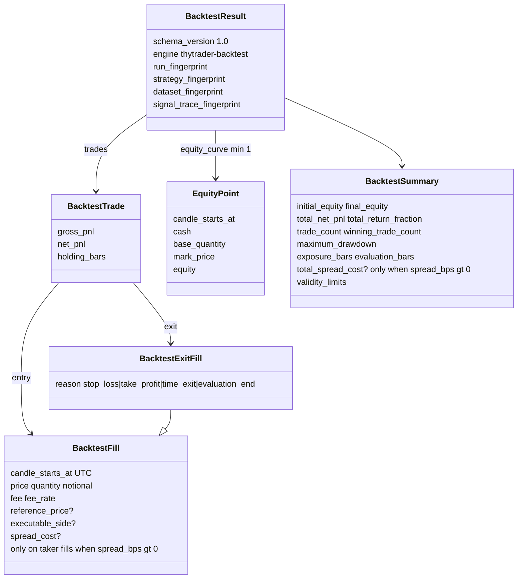
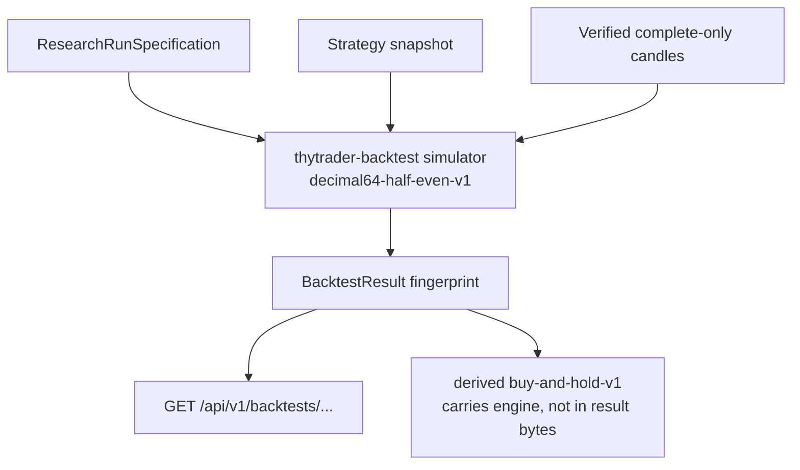

# Backtest result

Immutable simulation evidence for one research-run under the single backtest
model `engine: "thytrader-backtest"`
([ADR 0083](../../decisions/0083-unified-backtest-model.md)). Not order authority.
Field rules: [backtest simulation](../backtest-simulation.md).
Model: `thytrader.backtest.models.BacktestResult`.

Canonical result JSON is sorted compact UTF-8. Its SHA-256 fingerprint is the
result identity. Append-only PostgreSQL `published_backtest_results`. Load
reverifies bytes, fingerprint, row identity, and the source run. Buy-and-hold
comparison is a **derived** `thytrader-buy-and-hold-v1` report. Sharpe-class
ratios are a **derived** `thytrader-performance-metrics-v1` report. Neither is
part of canonical result bytes.

```mermaid
classDiagram
  class BacktestResult {
    schema_version 1.0
    engine thytrader-backtest
    run_fingerprint
    strategy_fingerprint
    dataset_fingerprint
    signal_trace_fingerprint
  }
  class BacktestTrade {
    gross_pnl
    net_pnl
    holding_bars
  }
  class BacktestFill {
    candle_starts_at UTC
    price quantity notional
    fee fee_rate
    reference_price?
    executable_side?
    spread_cost?
    only on taker fills when spread_bps gt 0
  }
  class BacktestExitFill {
    reason stop_loss|take_profit|time_exit|evaluation_end
  }
  class EquityPoint {
    candle_starts_at
    cash
    base_quantity
    mark_price
    equity
  }
  class BacktestSummary {
    initial_equity final_equity
    total_net_pnl total_return_fraction
    trade_count winning_trade_count
    maximum_drawdown
    exposure_bars evaluation_bars
    total_spread_cost? only when spread_bps gt 0
    validity_limits
  }
  BacktestResult --> BacktestTrade : trades
  BacktestResult --> EquityPoint : equity_curve min 1
  BacktestResult --> BacktestSummary
  BacktestTrade --> BacktestFill : entry
  BacktestTrade --> BacktestExitFill : exit
  BacktestExitFill --|> BacktestFill
```

```mermaid
flowchart TD
  Run["ResearchRunSpecification"] --> Sim["thytrader-backtest simulator\ndecimal64-half-even-v1"]
  Strat["Strategy snapshot"] --> Sim
  Data["Verified complete-only candles"] --> Sim
  Sim --> Result["BacktestResult fingerprint"]
  Result --> API["GET /api/v1/backtests/..."]
  Result --> BH["derived buy-and-hold-v1\ncarries engine, not in result bytes"]
```

Results carry `engine` and no `broker` block; the run's `costs` (including
`spread_bps`) is the only cost authority. A zero `spread_bps` produces bytes
identical to omitting it. Every summary carries `validity_limits`
(`maker_touch_full_fill`, `tp_before_stop_same_bar`, plus `spot_short_synthetic`
for shorts). The equity curve has one point per evaluation close plus one
terminal point at `evaluation.ends_at`. The simulator does not create an order
intent.
