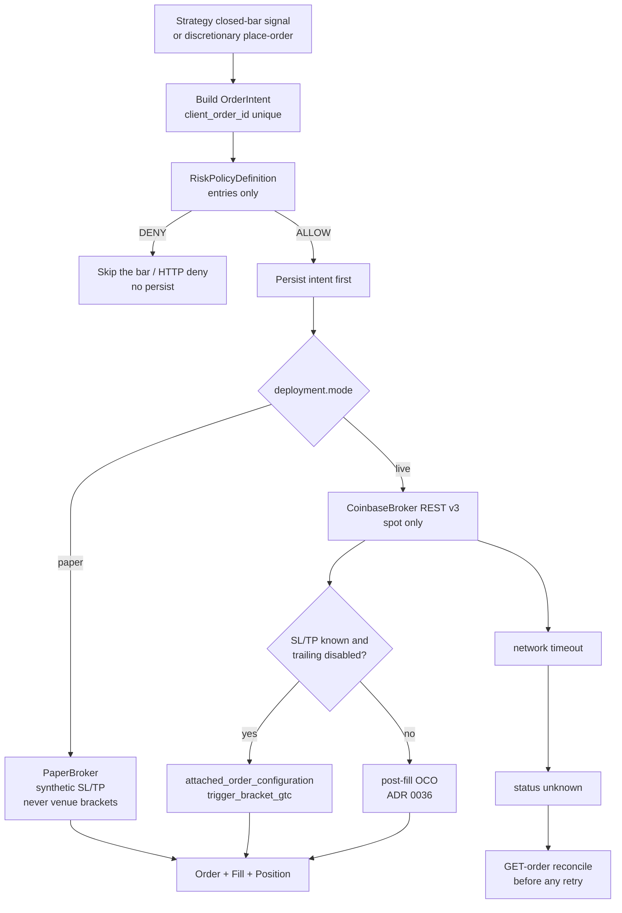
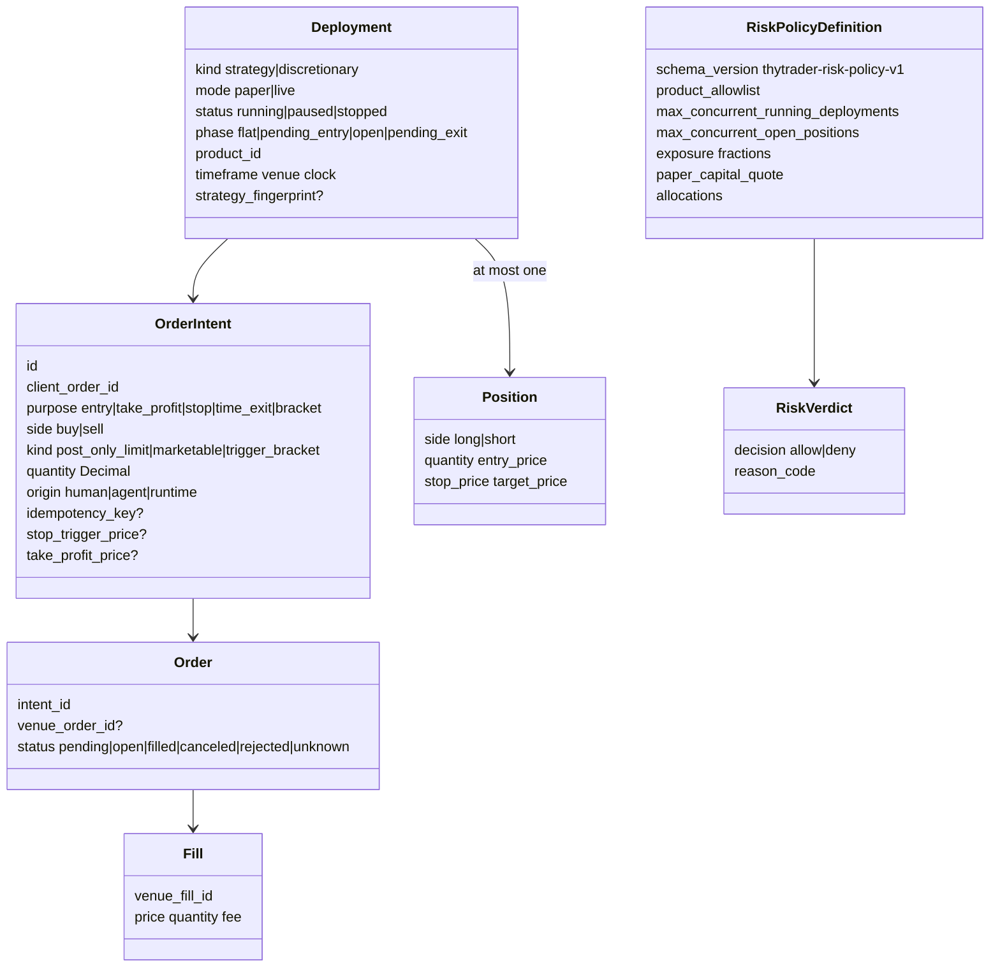

# Order intent → risk → broker

A signal or discretionary action creates an **order intent**. It does not call
Coinbase directly. Models: `thytrader.execution.models.OrderIntent`,
`thytrader.risk.models.RiskPolicyDefinition`, `PaperBroker`,
`CoinbaseBroker`.

Entries are gated by the risk-policy registry **before** intent persist. Exits
are not. Timeouts persist `unknown` and GET-order reconcile; they are not proof
of failure. Unique `client_order_id`. Live start and live place-order need
`--i-understand-live`.

Live shorts fail closed without available base (`INSUFFICIENT_BASE_FOR_SPOT_SHORT`).
Never `leverage`, `margin_type`, or futures. Nonempty allocations deny
discretionary. Stale data or unhealthy required connections block new
risk-increasing orders.
