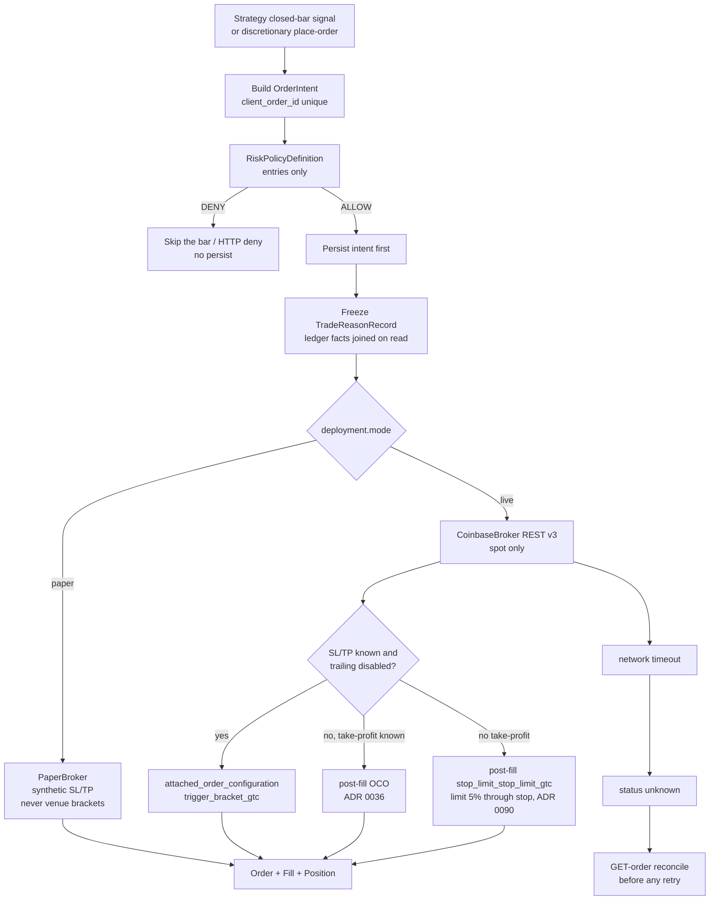
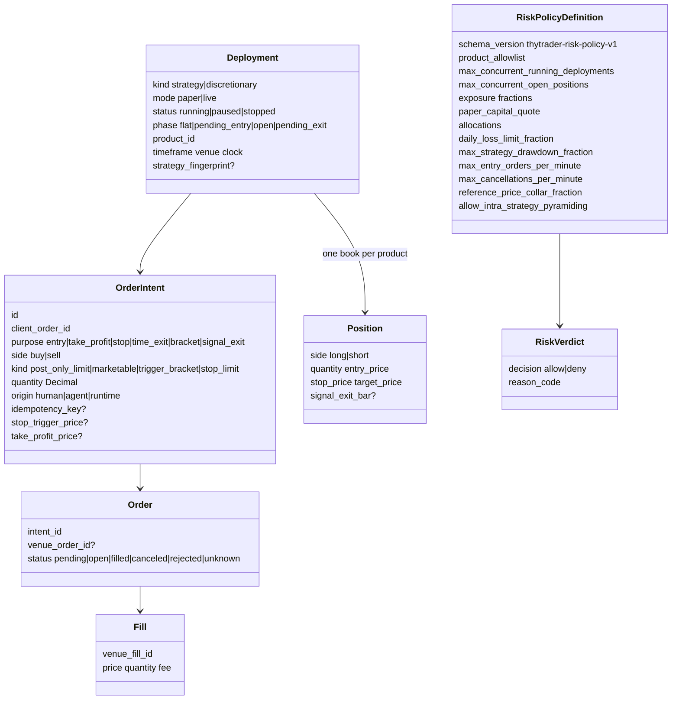
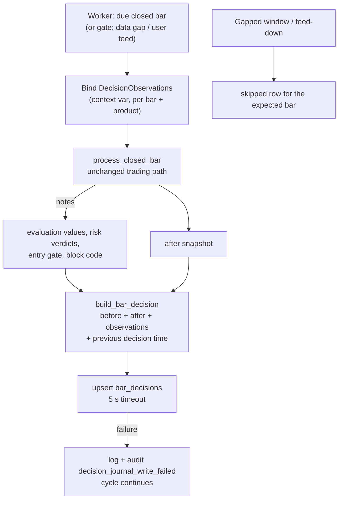
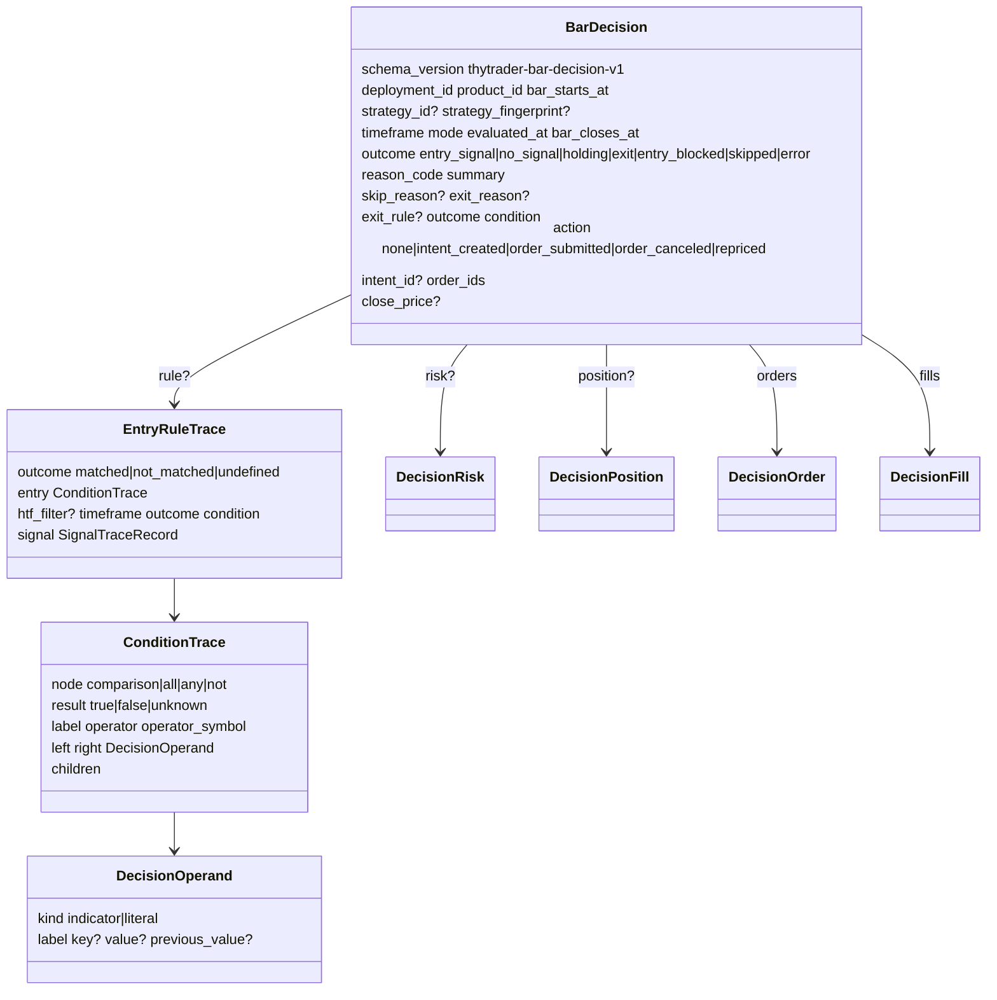

# Order intent → risk → broker

A signal or discretionary action creates an **order intent**. It does not call
Coinbase directly. Models: `thytrader.execution.models.OrderIntent`,
`thytrader.risk.models.RiskPolicyDefinition`, `PaperBroker`,
`CoinbaseBroker`.

Entries are gated by the risk-policy registry **before** intent persist. Exits
are not. Timeouts persist `unknown` and GET-order reconcile; they are not proof
of failure. Unique `client_order_id`. Live start and live place-order need
`--i-understand-live`.

```mermaid
flowchart TD
  Src["Strategy closed-bar signal\nor discretionary place-order"] --> IntentDraft["Build OrderIntent\nclient_order_id unique"]
  IntentDraft --> Risk["RiskPolicyDefinition\nentries only"]
  Risk -->|DENY| Skip["Skip the bar / HTTP deny\nno persist"]
  Risk -->|ALLOW| Persist["Persist intent first"]
  Persist --> Why["Freeze TradeReasonRecord\nledger facts joined on read"]
  Why --> Mode{"deployment.mode"}
  Mode -->|paper| Paper["PaperBroker\nsynthetic SL/TP\nnever venue brackets"]
  Mode -->|live| Live["CoinbaseBroker REST v3\nspot only"]
  Live --> Attach{"SL/TP known and\ntrailing disabled?"}
  Attach -->|yes| Attached["attached_order_configuration\ntrigger_bracket_gtc"]
  Attach -->|no, take-profit known| PostFill["post-fill OCO\nADR 0036"]
  Attach -->|no take-profit| StopOnly["post-fill stop_limit_stop_limit_gtc\nlimit 5% through stop, ADR 0090"]
  StopOnly --> Order
  Paper --> Order["Order + Fill + Position"]
  Attached --> Order
  PostFill --> Order
  Live --> Timeout["network timeout"]
  Timeout --> Unknown["status unknown"]
  Unknown --> Reconcile["GET-order reconcile\nbefore any retry"]
```

```mermaid
classDiagram
  class Deployment {
    kind strategy|discretionary
    mode paper|live
    status running|paused|stopped
    phase flat|pending_entry|open|pending_exit
    product_id
    timeframe venue clock
    strategy_fingerprint?
  }
  class OrderIntent {
    id
    client_order_id
    purpose entry|take_profit|stop|time_exit|bracket|signal_exit
    side buy|sell
    kind post_only_limit|marketable|trigger_bracket|stop_limit
    quantity Decimal
    origin human|agent|runtime
    idempotency_key?
    stop_trigger_price?
    take_profit_price?
  }
  class Order {
    intent_id
    venue_order_id?
    status pending|open|filled|canceled|rejected|unknown
  }
  class Fill {
    venue_fill_id
    price quantity fee
  }
  class Position {
    side long|short
    quantity entry_price
    stop_price target_price
    signal_exit_bar?
  }
  class RiskPolicyDefinition {
    schema_version thytrader-risk-policy-v1
    product_allowlist
    max_concurrent_running_deployments
    max_concurrent_open_positions
    exposure fractions
    paper_capital_quote
    allocations
    daily_loss_limit_fraction
    max_strategy_drawdown_fraction
    max_entry_orders_per_minute
    max_cancellations_per_minute
    reference_price_collar_fraction
    allow_intra_strategy_pyramiding
  }
  class RiskVerdict {
    decision allow|deny
    reason_code
  }
  Deployment --> OrderIntent
  OrderIntent --> Order
  Order --> Fill
  Deployment --> Position : one book per product
  RiskPolicyDefinition --> RiskVerdict
```

Live shorts fail closed without available base (`INSUFFICIENT_BASE_FOR_SPOT_SHORT`).
Never `leverage`, `margin_type`, or futures. Nonempty allocations deny
discretionary. Stale data or unhealthy required connections block new
risk-increasing orders.

Paper order status is fill-atomic (ADR 0057): `apply_fill_transaction` commits
the fill row, order `filled` status, and cash/position projection together. A
failed fill ingest leaves the order `open`, so the next closed bar retries the
match instead of stranding a `filled` order without a fill. A `pending_entry`
book with neither a working entry nor a position is split state: the runtime
pauses it with a mismatch detail, and operator reconciliation reports
`FILLED_WITHOUT_FILL` or `PENDING_ENTRY_WITHOUT_ENTRY`. Live reconcile pauses report
`STATE_MISMATCH` with the `mismatch_detail`; `Filled order has no REST fills.` also reports
`FILLED_WITHOUT_FILL`.

Live create outcomes ([ADR 0078](../../decisions/0078-live-readiness-http-ack-venue-reload-definite-rejects.md)): Coinbase `success=false` or HTTP
400/401/403/404/422 is a definite `rejected` order. Timeouts, 408/409/429/5xx, and transport
failures are ambiguous `unknown` orders with no venue id; reconcile looks them up by
`client_order_id` (bounded to the product and a window from five minutes before submit), adopts a
hit, and otherwise keeps the book paused. Nothing is re-submitted automatically.

## Per-bar decision journal

Every closed bar a paper or live strategy bot processes is explained by one
`thytrader-bar-decision-v1` record ([ADR 0087](../../decisions/0087-per-bar-decision-timeline.md)).
Models: `thytrader.execution.decisions.BarDecision` (record),
`thytrader.execution.decision_builder` (classification),
`thytrader.execution.decision_store.DecisionJournalStore` (storage protocol),
`thytrader.persistence.postgres_decisions.PostgresDecisionJournalStore` (table `bar_decisions`,
Alembic `0053`).

Identity is `(deployment_id, product_id, bar_starts_at)`; writes are upserts, so a restart replay
rewrites the same row. Multi-instrument documents write one row per covered product per bar. The
execution worker binds an observation scope around each closed-bar call; the loop reports only
facts a before/after snapshot cannot show (the `LatestEntryEvaluation` values the entry rule read,
risk/freshness/breaker verdicts, why no entry was attempted, why a matched signal sent nothing).
Intents, orders, fills, position, and pause state come from the snapshots. Nothing is recomputed:
each rule node's result is `entry_condition_outcome` on that node with the same merged values, and
the indicator values reuse the research `SignalTraceRecord`.

```mermaid
flowchart TD
  Due["Worker: due closed bar\n(or gate: data gap / user feed)"] --> Scope["Bind DecisionObservations\n(context var, per bar + product)"]
  Scope --> Loop["process_closed_bar\nunchanged trading path"]
  Loop -->|notes| Obs["evaluation values, risk verdicts,\nentry gate, block code"]
  Loop --> After["after snapshot"]
  Obs --> Build["build_bar_decision\nbefore + after + observations\n+ previous decision time"]
  After --> Build
  Build --> Upsert["upsert bar_decisions\n5 s timeout"]
  Upsert -->|failure| Audit["log + audit decision_journal_write_failed\ncycle continues"]
  Gate["Gapped window / feed-down"] --> Skip["skipped row for the expected bar"]
```

```mermaid
classDiagram
  class BarDecision {
    schema_version thytrader-bar-decision-v1
    deployment_id product_id bar_starts_at
    strategy_id? strategy_fingerprint?
    timeframe mode evaluated_at bar_closes_at
    outcome entry_signal|no_signal|holding|exit|entry_blocked|skipped|error
    reason_code summary
    skip_reason? exit_reason?
    exit_rule? outcome condition
    action none|intent_created|order_submitted|order_canceled|repriced
    intent_id? order_ids
    close_price?
  }
  class EntryRuleTrace {
    outcome matched|not_matched|undefined
    entry ConditionTrace
    htf_filter? timeframe outcome condition
    signal SignalTraceRecord
  }
  class ConditionTrace {
    node comparison|all|any|not
    result true|false|unknown
    label operator operator_symbol
    left right DecisionOperand
    children
  }
  class DecisionOperand {
    kind indicator|literal
    label key? value? previous_value?
  }
  BarDecision --> EntryRuleTrace : rule?
  BarDecision --> DecisionRisk : risk?
  BarDecision --> DecisionPosition : position?
  BarDecision --> DecisionOrder : orders
  BarDecision --> DecisionFill : fills
  EntryRuleTrace --> ConditionTrace
  ConditionTrace --> DecisionOperand
```

Outcome precedence: `error` (raised cycle or fail-closed evaluation) → `entry_signal` (new entry
intent after an evaluated match; `action` is `order_submitted` or `intent_created`; a replacement
entry without an evaluation is a `skipped`/`pending_entry` bar with `action` `repriced`) → `exit`
(new stop/time/signal intent, or an exit order whose fill was applied since the previous decision — a
venue bracket filled between bars belongs to the next bar; `exit_reason` `stop`, `trail`, `target`,
`time`, `flatten`, `signal`) → a matched `exits.signal_exit` rule whose sell still waits on a
protection cancel (`exit`, `EXIT_SIGNAL`; [ADR 0093](../../decisions/0093-signal-based-exits.md)) →
`entry_blocked` (risk or freshness deny, ATR/sizing/base/maker-price block) →
evaluated rule (`holding` with a book, `skipped`/`warmup` when undefined, else `no_signal` with
`CONDITIONS_NOT_MET` or `HTF_FILTER_NOT_MET`) → canceled working entry → `holding` → `skipped`
(breaker pause, cooldown, max open positions, pending entry, paused, stopped, entries disabled,
catch-up). Bars already evaluated (between-bar protection) are not journaled again.

Journaling never alters or blocks trading: notes only assign fields, the record is built after the
closed-bar call returns, each write has a 5-second timeout, failures are logged and audited at most
every 15 minutes per bot, and no exchange call is made. Retention runs in the execution worker at
startup and every 6 hours: rows older than 180 days and beyond the newest 20,000 per bot are deleted
in passes of at most 5,000 rows. Rows cascade with their deployment.
