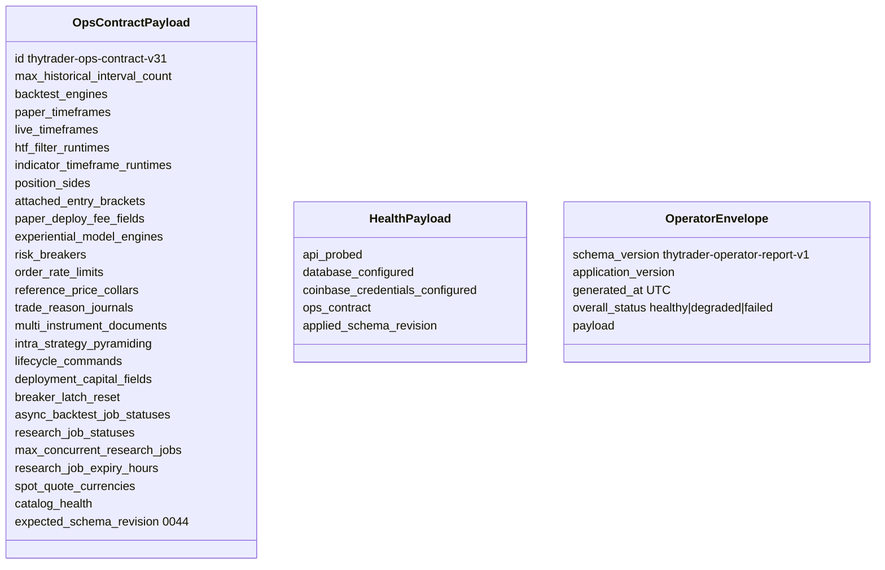

# Ops contract

CLI versus running-image **content identity**. Package version `0.1.0` is not
current-image evidence. Model: `thytrader.operator.models.OpsContractPayload`.
Compiled expected payload: `thytrader.ops_contract.expected_ops_contract()`.

Every HTTP agent CLI preflights `GET /health/ready` and fails closed on a
missing or unequal contract. Rebuild with `make run`. Do not default-fill a
missing payload.

Current checkout (Alembic `0044`):

| Field | Shipped value |
|---|---|
| `id` | `thytrader-ops-contract-v31` |
| `expected_schema_revision` | `0044` |
| `async_backtest_job_statuses` | `queued`, `running`, `completed`, `failed`, `cancelled`, `expired` |
| `research_job_statuses` | same as `async_backtest_job_statuses` |
| `max_concurrent_research_jobs` | `2` |
| `research_job_expiry_hours` | `24` |
| `spot_quote_currencies` | `USD`, `USDC` |
| `catalog_health` | `bounded_gap_inspection`, `ingest_self_complete`, `heartbeat_during_ingest` |
| `max_historical_interval_count` | `129600` |
| `backtest_engines` | `thytrader-bar-backtest-v1`, `v2`, `v3`, `v4` |
| `paper_timeframes` / `live_timeframes` | `1m` `5m` `15m` `30m` `1h` `2h` `4h` `6h` `1d` |
| `htf_filter_runtimes` | `research`, `paper`, `live` |
| `indicator_timeframe_runtimes` | `research`, `paper`, `live` |
| `position_sides` | `long`, `short` |
| `attached_entry_brackets` | `paper`, `live` |
| `paper_deploy_fee_fields` | `maker_fee_rate`, `taker_fee_rate` |
| `experiential_model_engines` | `thytrader-experiential-train-v1` |
| `risk_breakers` | `daily_loss`, `drawdown` |
| `order_rate_limits` | `entry`, `cancel` |
| `reference_price_collars` | `paper`, `live` |
| `trade_reason_journals` | `paper`, `live` |
| `multi_instrument_documents` | `research`, `paper`, `live` |
| `intra_strategy_pyramiding` | `research`, `paper`, `live` |
| `lifecycle_commands` | `none`, `stop_new_entries`, `flatten`, `managed_shutdown` |
| `deployment_capital_fields` | `allocated_capital`, `venue_available_quote`, `reserved_buying_power`, `inventory_cost`, `performance_equity`, `initial_equity`, `baseline_equity`, `high_water_mark_equity`, `utc_day_open_equity` |
| `breaker_latch_reset` | `paper`, `live` |

