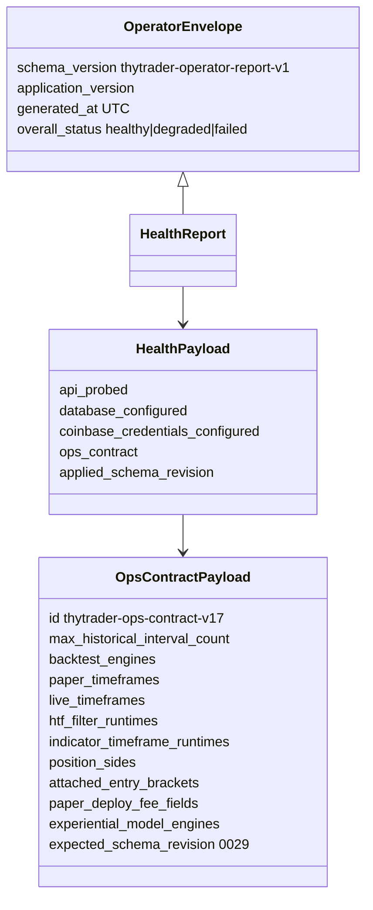
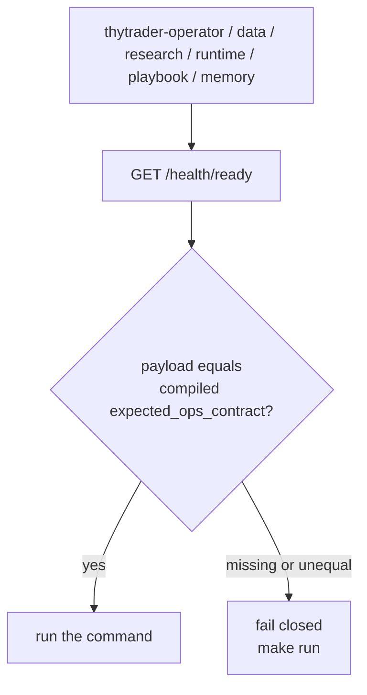

# Ops contract

CLI versus running-image **content identity**. Package version `0.1.0` is not
current-image evidence. Model: `thytrader.operator.models.OpsContractPayload`.
Compiled expected payload: `thytrader.ops_contract.expected_ops_contract()`.

Every HTTP agent CLI preflights `GET /health/ready` and fails closed on a
missing or unequal contract. Rebuild with `make run`. Do not default-fill a
missing payload.

Current checkout (Alembic `0029`):

| Field | Shipped value |
|---|---|
| `id` | `thytrader-ops-contract-v17` |
| `expected_schema_revision` | `0029` |
| `max_historical_interval_count` | `129600` |
| `backtest_engines` | `thytrader-bar-backtest-v1`, `v2`, `v3` |
| `paper_timeframes` / `live_timeframes` | `1m` `5m` `15m` `30m` `1h` `2h` `4h` `6h` `1d` |
| `htf_filter_runtimes` | `research`, `paper`, `live` |
| `indicator_timeframe_runtimes` | `research`, `paper`, `live` |
| `position_sides` | `long`, `short` |
| `attached_entry_brackets` | `paper`, `live` |
| `paper_deploy_fee_fields` | `maker_fee_rate`, `taker_fee_rate` |
| `experiential_model_engines` | `thytrader-experiential-train-v1` |

Bump `OPS_CONTRACT_ID` when paper/live clocks, engines, the interval cap, the
expected Alembic revision, risk-policy registry, live extras, memory
persistence, experiential-model engines, discretionary identity, HTF evaluation,
per-indicator clocks, spot shorting, attached entry brackets, or paper deploy
fee fields change
([ADR 0019](../../decisions/0019-ops-contract-identity.md),
[ADR 0048](../../decisions/0048-paper-deploy-fee-fields.md),
[ADR 0049](../../decisions/0049-experiential-train-v1.md)).
