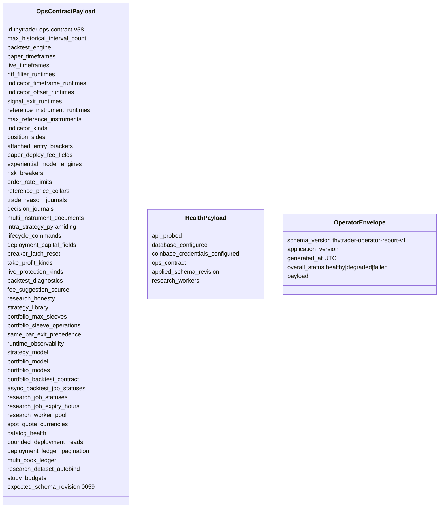

# Ops contract

CLI versus running-image **content identity**. Package version `0.1.0` is not
current-image evidence. Model: `thytrader.operator.models.OpsContractPayload`.
Compiled expected payload: `thytrader.ops_contract.expected_ops_contract()`.

Every HTTP agent CLI preflights `GET /health/ready` and fails closed on a
missing or unequal contract. Rebuild with `make run`. Do not default-fill a
missing payload.

Current checkout (Alembic `0059`):

| Field | Shipped value |
|---|---|
| `id` | `thytrader-ops-contract-v58` |
| `expected_schema_revision` | `0059` |
| `strategy_model` | `mutable_root`, `auto_snapshot`, `hard_delete` ([ADR 0082](../../decisions/0082-strategy-root-mutable-strategies-auto-snapshots.md)) |
| `portfolio_model` | `sleeves`, `shared_limits`, `manager_settings`, `journal`, `portfolio_backtest` ([ADR 0088](../../decisions/0088-portfolio-model-and-portfolio-backtest.md)), `deployment`, `portfolio_limits`, `manager_proposals` ([ADR 0091](../../decisions/0091-portfolio-deployment-limits-and-manager-proposals.md)) |
| `portfolio_modes` | `paper`, `live` |
| `portfolio_backtest_contract` | `thytrader-portfolio-backtest-v1` |
| `portfolio_deployment` | `start`, `pause`, `resume`, `stop`, `sleeve_actions`, `breaker_reset` (ADR 0091) |
| `portfolio_breakers` | `PORTFOLIO_DAILY_LOSS_STOP`, `PORTFOLIO_DRAWDOWN_STOP` (ADR 0091) |
| `portfolio_proposal_kinds` | `rebalance`, `pause_sleeve`, `resume_sleeve`, `add_sleeve` — no order kind exists (ADR 0091) |
| `portfolio_briefing_contract` | `thytrader-portfolio-briefing-v1` (ADR 0091) |
| `async_backtest_job_statuses` | `queued`, `running`, `completed`, `failed`, `cancelled`, `expired` |
| `research_job_statuses` | same as `async_backtest_job_statuses` |
| `research_job_expiry_hours` | `24` |
| `research_worker_pool` | `lease_claim`, `crash_requeue`, `process_recycle`, `sync_long_poll`, `job_error_codes`, `health_queue_depth` ([ADR 0092](../../decisions/0092-research-worker-pool.md)). v52 dropped `max_concurrent_research_jobs` and `max_concurrent_portfolio_backtests`: concurrency is the deployment's `THYTRADER_RESEARCH_WORKER_COUNT`, reported by operator health as `payload.research_workers.configured_workers` |
| `spot_quote_currencies` | `USD`, `USDC`, `USDT` |
| `catalog_health` | `bounded_gap_inspection`, `ingest_self_complete`, `heartbeat_during_ingest`, `ranged_backfill`, `explicit_watch_ingest`, `research_lookback_ceilings` ([ADR 0085](../../decisions/0085-fast-research-ingest.md)), `no_trade_bars`, `listing_history_floor`, `watch_relative_complete` ([ADR 0095](../../decisions/0095-sparse-markets-no-trade-bars-listing-floors.md)) |
| `bounded_deployment_reads` | `list`, `summary`, `fills`, `orders` |
| `deployment_ledger_pagination` | `cursor` |
| `multi_book_ledger` | `paper`, `live` |
| `max_historical_interval_count` | `129600` |
| `backtest_engine` | `thytrader-backtest` — the single unified model ([ADR 0083](../../decisions/0083-unified-backtest-model.md)); replaced the `backtest_engines` list |
| `paper_timeframes` / `live_timeframes` | `1m` `5m` `15m` `30m` `1h` `2h` `4h` `6h` `1d` |
| `htf_filter_runtimes` | `research`, `paper`, `live` |
| `indicator_timeframe_runtimes` | `research`, `paper`, `live` |
| `indicator_offset_runtimes` | `research`, `paper`, `live` — per-declaration bar lag ([ADR 0086](../../decisions/0086-indicator-catalog-expansion-and-offset.md)) |
| `signal_exit_runtimes` | `research`, `paper`, `live` — optional `exits.signal_exit` rule ([ADR 0093](../../decisions/0093-signal-based-exits.md)) |
| `reference_instrument_runtimes` | `research`, `paper`, `live` — read-only `data_requirements.reference_instruments` read by indicator `source` ([ADR 0096](../../decisions/0096-reference-instruments.md)) |
| `max_reference_instruments` | `3` |
| `indicator_kinds` | the 53 implemented kinds in operator `indicators` order (`ema` … `constant`, then `dema` … `percent_rank`, ADR 0086) |
| `position_sides` | `long`, `short` |
| `attached_entry_brackets` | `paper`, `live` |
| `paper_deploy_fee_fields` | `maker_fee_rate`, `taker_fee_rate` |
| `experiential_model_engines` | `thytrader-experiential-train-v1` |
| `risk_breakers` | `daily_loss`, `drawdown` |
| `order_rate_limits` | `entry`, `cancel` |
| `reference_price_collars` | `paper`, `live` |
| `trade_reason_journals` | `paper`, `live` |
| `decision_journals` | `paper`, `live` — per-bar decision timeline, `bar_decisions` ([ADR 0087](../../decisions/0087-per-bar-decision-timeline.md)) |
| `multi_instrument_documents` | `research`, `paper`, `live` |
| `intra_strategy_pyramiding` | `research`, `paper`, `live` |
| `lifecycle_commands` | `none`, `stop_new_entries`, `flatten`, `managed_shutdown` |
| `deployment_capital_fields` | `allocated_capital`, `venue_available_quote`, `reserved_buying_power`, `inventory_cost`, `performance_equity`, `initial_equity`, `baseline_equity`, `high_water_mark_equity`, `utc_day_open_equity` |
| `breaker_latch_reset` | `paper`, `live` |
| `research_dataset_autobind` | `backtest`, `study` — omitted dataset fingerprints bind the newest complete catalog dataset ([ADR 0089](../../decisions/0089-agent-research-ergonomics.md)) |
| `study_budgets` | `sync`: 8 candidates / 128 child windows; `async`: 64 candidates / 512 child windows (ADR 0089) |
| `take_profit_kinds` | `reward_risk`, `none` — optional take-profit ([ADR 0090](../../decisions/0090-research-correctness-optional-take-profit-diagnostics.md)) |
| `live_protection_kinds` | `trigger_bracket`, `stop_limit` — a no-take-profit live book rests a venue stop-limit (ADR 0090) |
| `backtest_diagnostics` | `thytrader-backtest-diagnostics-v1` — entry funnel stored beside results (ADR 0090) |
| `fee_suggestion_source` | `coinbase_account` — fee prefills are the account's reported rates (ADR 0090) |
| `research_honesty` | `result_window`, `study_axis_values`, `study_candidate_aggregates`, `study_stitched_points`, `document_issue_paths`, `json_number_decimals` ([ADR 0094](../../decisions/0094-research-honesty-and-agent-ergonomics.md)) |
| `strategy_library` | `tag_filter`, `bulk_delete_by_tag`, `clone_name` (ADR 0094); `origin_filter` — `GET /api/v1/strategies?origin=operator\|research\|all` (ADR 0098) |
| `portfolio_max_sleeves` | `32` (ADR 0094) |
| `portfolio_sleeve_operations` | `batch_add` — `POST /api/v1/portfolios/{id}/sleeves/batch`, one revision (ADR 0094) |
| `same_bar_exit_precedence` | `stop`, `take_profit`, `signal_exit`, `time_exit` — paper and the backtest resolve a same-bar exit tie in this order ([ADR 0097](../../decisions/0097-runtime-parity-and-observability.md)) |
| `runtime_observability` | `position_state`, `exit_in_flight`, `paper_live_fill_comparison` — deployment/operator/sleeve position state beside the raw `phase`, and the operator `portfolios` twin fill comparison (ADR 0097); `paper_protection_covered` (an open paper book's `protection_status` is `covered` on every read), `book_marks` (`mark_price` / `marked_at` / `unrealized_pnl` on deployment positions and sleeve `books[]`), `portfolio_fill_comparisons` (`GET /api/v1/portfolios/{id}/fill-comparisons`) (ADR 0098) |

```mermaid
classDiagram
  class OpsContractPayload {
    id thytrader-ops-contract-v58
    max_historical_interval_count
    backtest_engine
    paper_timeframes
    live_timeframes
    htf_filter_runtimes
    indicator_timeframe_runtimes
    indicator_offset_runtimes
    signal_exit_runtimes
    reference_instrument_runtimes
    max_reference_instruments
    indicator_kinds
    position_sides
    attached_entry_brackets
    paper_deploy_fee_fields
    experiential_model_engines
    risk_breakers
    order_rate_limits
    reference_price_collars
    trade_reason_journals
    decision_journals
    multi_instrument_documents
    intra_strategy_pyramiding
    lifecycle_commands
    deployment_capital_fields
    breaker_latch_reset
    take_profit_kinds
    live_protection_kinds
    backtest_diagnostics
    fee_suggestion_source
    research_honesty
    strategy_library
    portfolio_max_sleeves
    portfolio_sleeve_operations
    same_bar_exit_precedence
    runtime_observability
    strategy_model
    portfolio_model
    portfolio_modes
    portfolio_backtest_contract
    async_backtest_job_statuses
    research_job_statuses
    research_job_expiry_hours
    research_worker_pool
    spot_quote_currencies
    catalog_health
    bounded_deployment_reads
    deployment_ledger_pagination
    multi_book_ledger
    research_dataset_autobind
    study_budgets
    expected_schema_revision 0059
  }
  class HealthPayload {
    api_probed
    database_configured
    coinbase_credentials_configured
    ops_contract
    applied_schema_revision
    research_workers
  }
  class OperatorEnvelope {
    schema_version thytrader-operator-report-v1
    application_version
    generated_at UTC
    overall_status healthy|degraded|failed
    payload
  }
```
