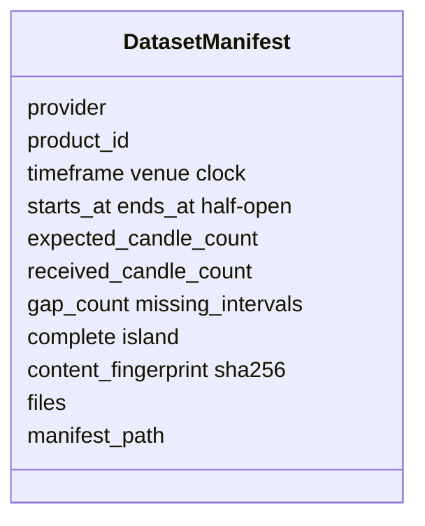
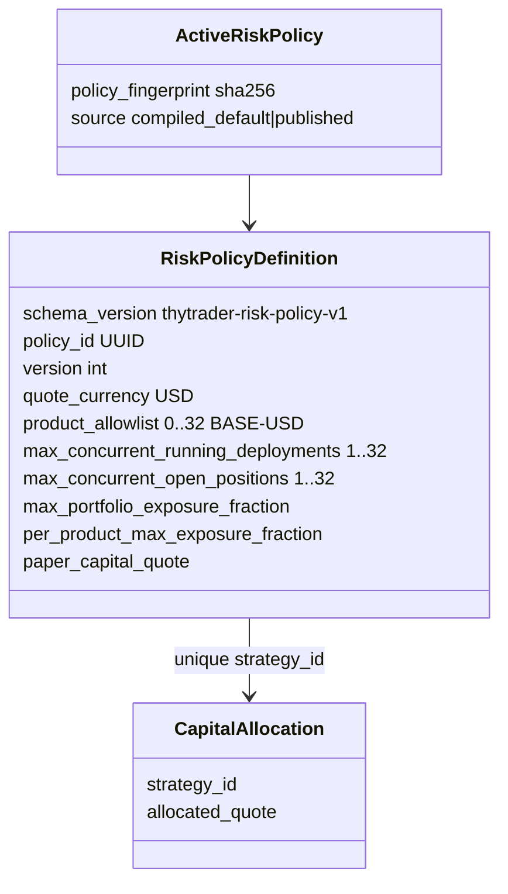
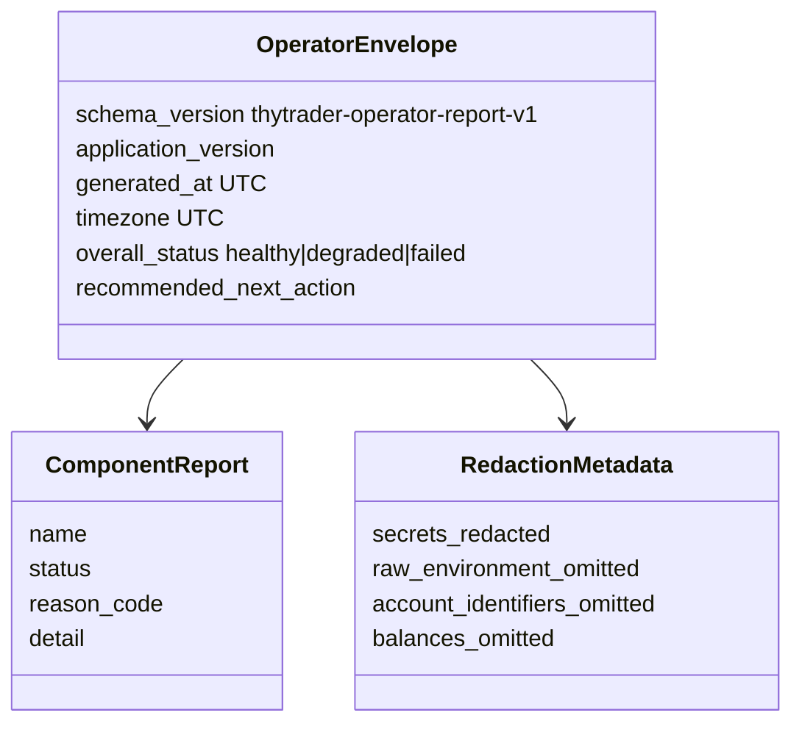
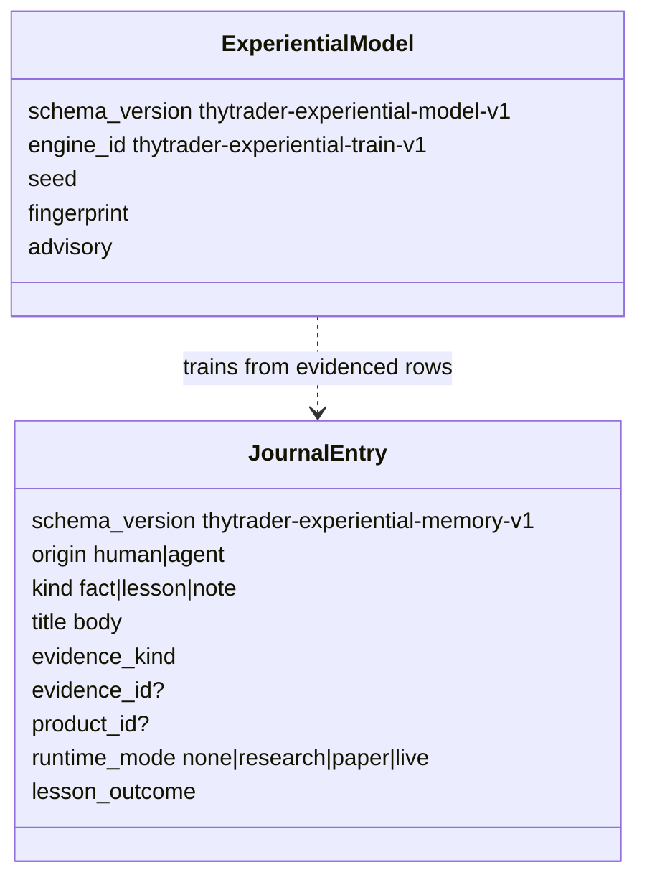

# Other durable payloads

Additional shipped contracts operators and agents already share. Not destination
remainders.

## Dataset manifest

Worker-owned complete-only Parquet. Model: `thytrader.market_data.datasets.DatasetManifest`.
`complete` is island completeness. Judge a watch by `watch_complete`. Missing
candles are never interpolated.

## Risk-policy registry

Immutable `thytrader-risk-policy-v1`. See [execution](execution.md) for the
entry gate. Fingerprint is `sha256:` of canonical policy JSON.

Daily-loss / drawdown breakers, order-rate limits, and reference-price collars
are **not** in this document.

## Operator report envelope

Every machine-readable `thytrader-operator` report. Schema:
`thytrader-operator-report-v1`.

Report kinds: health, configuration, exchange, market_data, data_catalog,
products, indicators, strategies, performance, risk, reconciliation, runtime,
monitor, support_bundle.

## Experiential memory hooks

`thytrader-experiential-memory-v1` journals. Origin `human` or `agent` is
required. Bounded V1 training is `thytrader-experiential-train-v1` (advisory
only; [ADR 0049](../../decisions/0049-experiential-train-v1.md)). Per-trade
“why it was made” records remain destination.

