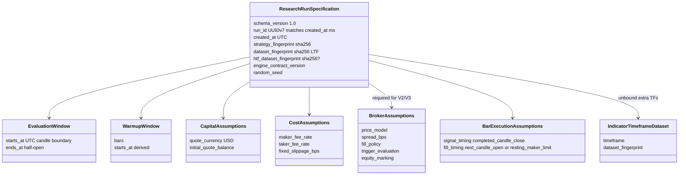
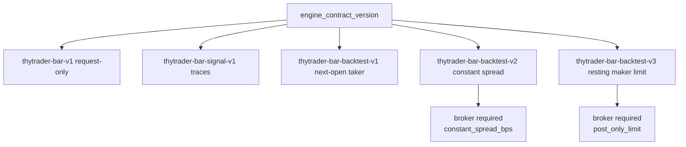

# Research-run specification

Immutable research **request**, not proof a backtest ran and not order authority.
Field rules: [research-run specification](../research-run-specification.md).
Model: `thytrader.research.models.ResearchRunSpecification`.

PostgreSQL table `published_research_run_specs`. Publication reverifies the
published strategy, verified dataset, and existing strategy/dataset binding.
Fingerprint is `sha256:` of the canonical document.

HTF dataset fingerprint is required iff the strategy declares `htf_filter`, must
differ from the LTF dataset, and is omitted from canonical JSON when null.
`indicator_dataset_fingerprints` bind unbound extra indicator clocks. Warmup
must equal `evaluation.starts_at` minus `warmup.bars` times the LTF duration.
The LTF dataset must cover one extra decision bar after evaluation end for
next-open fill data.
