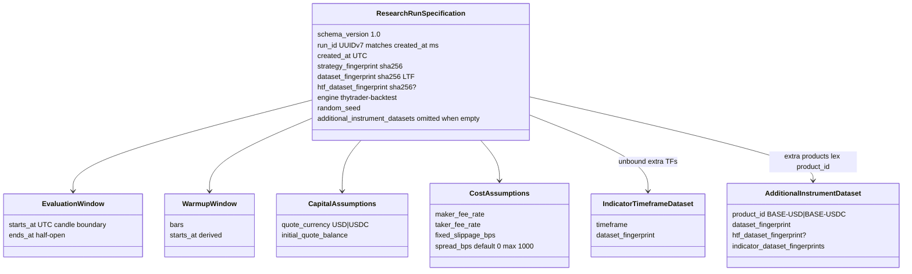
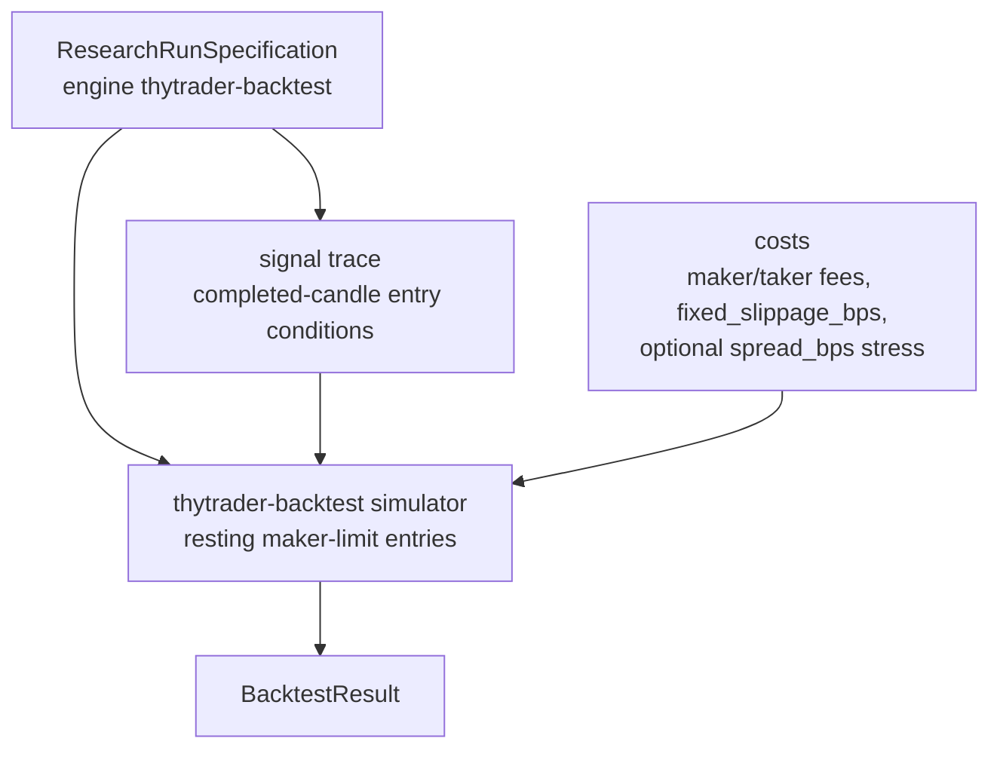

# Research-run specification

Immutable research **request**, not proof a backtest ran and not order authority.
There is one backtest model, `engine: "thytrader-backtest"`
([ADR 0083](../../decisions/0083-unified-backtest-model.md)); the run carries no
`broker`, `bar_execution`, or engine-version field.
Field rules: [research-run specification](../research-run-specification.md).
Model: `thytrader.research.models.ResearchRunSpecification`.

PostgreSQL table `published_research_run_specs`. Publication reverifies the
strategy snapshot, verified dataset, and existing strategy/dataset binding.
Fingerprint is `sha256:` of the canonical document.

```mermaid
classDiagram
  class ResearchRunSpecification {
    schema_version 1.0
    run_id UUIDv7 matches created_at ms
    created_at UTC
    strategy_fingerprint sha256
    dataset_fingerprint sha256 LTF
    htf_dataset_fingerprint sha256?
    engine thytrader-backtest
    random_seed
    additional_instrument_datasets omitted when empty
  }
  class EvaluationWindow {
    starts_at UTC candle boundary
    ends_at half-open
  }
  class WarmupWindow {
    bars
    starts_at derived
  }
  class CapitalAssumptions {
    quote_currency USD|USDC
    initial_quote_balance
  }
  class CostAssumptions {
    maker_fee_rate
    taker_fee_rate
    fixed_slippage_bps
    spread_bps default 0 max 1000
  }
  class IndicatorTimeframeDataset {
    timeframe
    dataset_fingerprint
  }
  class AdditionalInstrumentDataset {
    product_id BASE-USD|BASE-USDC
    dataset_fingerprint
    htf_dataset_fingerprint?
    indicator_dataset_fingerprints
  }
  ResearchRunSpecification --> EvaluationWindow
  ResearchRunSpecification --> WarmupWindow
  ResearchRunSpecification --> CapitalAssumptions
  ResearchRunSpecification --> CostAssumptions
  ResearchRunSpecification --> IndicatorTimeframeDataset : unbound extra TFs
  ResearchRunSpecification --> AdditionalInstrumentDataset : extra products lex product_id
```

```mermaid
flowchart TD
  Run["ResearchRunSpecification\nengine thytrader-backtest"] --> Trace["signal trace\ncompleted-candle entry conditions"]
  Run --> Sim["thytrader-backtest simulator\nresting maker-limit entries"]
  Trace --> Sim
  Costs["costs\nmaker/taker fees, fixed_slippage_bps,\noptional spread_bps stress"] --> Sim
  Sim --> Result["BacktestResult"]
```

HTF dataset fingerprint is required iff the strategy declares `htf_filter`, must
differ from the LTF dataset, and is omitted from canonical JSON when null.
`indicator_dataset_fingerprints` bind unbound extra indicator clocks. Warmup
must equal `evaluation.starts_at` minus `warmup.bars` times the LTF duration.
The LTF dataset must cover the decision bar that opens at `evaluation.ends_at`,
whose open prices end-of-window liquidation. `dataset_fingerprint` remains the primary instrument.
`additional_instrument_datasets` binds extra covered products (omitted when
empty, lexicographic `product_id`). Each extra product needs a complete
decision-clock dataset; HTF and extra-TF fingerprints are required iff the
document declares those clocks.
