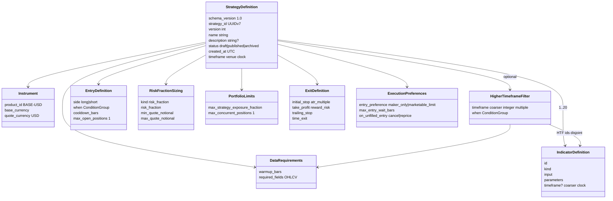
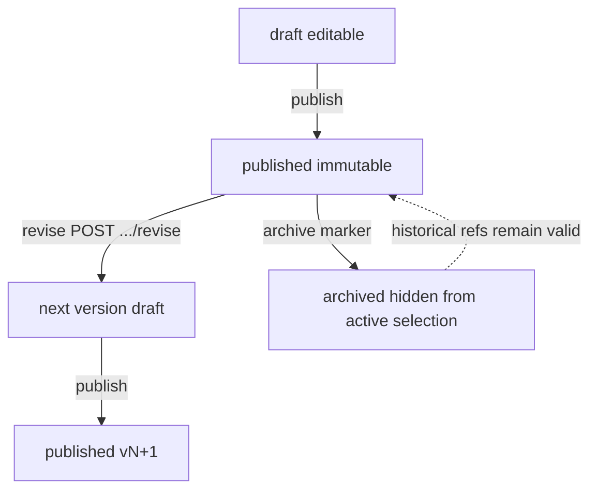

# Strategy schema

Canonical published document. Field rules:
[canonical strategy schema](../canonical-strategy-schema.md).
Model: `thytrader.strategies.models.StrategyDefinition`.

Fingerprint is `sha256:` of sorted compact UTF-8 JSON over the entire published
document. Unknown fields are rejected. One product per document.
`max_concurrent_positions` and `max_open_positions` are `1`. `entry.side` is
`long` or `short`. Venue clocks: `1m`, `5m`, `15m`, `30m`, `1h`, `2h`, `4h`,
`6h`, `1d`.

`htf_filter` is omitted from canonical JSON when null. Optional per-indicator
`timeframe` is omitted when absent. Paper and live evaluate `htf_filter` on
last-completed complete-only HTF bars. Multi-instrument documents are not legal
here.
