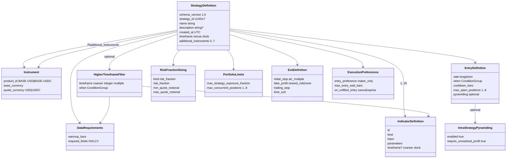
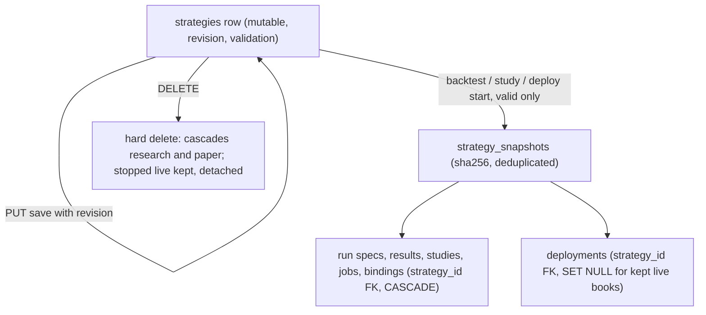

# Strategy schema

Canonical strategy document (the content of a mutable strategy and of each snapshot). Field rules:
[canonical strategy schema](../canonical-strategy-schema.md).
Model: `thytrader.strategies.models.StrategyDefinition`.

Fingerprint is `sha256:` of sorted compact UTF-8 JSON over the entire snapshotted
document. `version` and `status` are not document fields; legacy input keys are discarded
([ADR 0082](../../decisions/0082-strategy-root-mutable-strategies-auto-snapshots.md)). Unknown fields are rejected. `instrument` is the primary Coinbase
USD spot product. Optional `additional_instruments` lists 1–7 extra unique USD
spot products (at most eight total). `max_concurrent_positions` is 1–8 and must
not exceed covered products. `max_open_positions` is 1 unless
`entry.pyramiding` is enabled. `entry.side` is `long` or `short`. Venue clocks:
`1m`, `5m`, `15m`, `30m`, `1h`, `2h`, `4h`, `6h`, `1d`.

```mermaid
classDiagram
  class StrategyDefinition {
    schema_version 1.0
    strategy_id UUIDv7
    name string
    description string?
    created_at UTC
    timeframe venue clock
    additional_instruments 0..7
  }
  class Instrument {
    product_id BASE-USD|BASE-USDC
    base_currency
    quote_currency USD|USDC
  }
  class DataRequirements {
    warmup_bars
    required_fields OHLCV
  }
  class IndicatorDefinition {
    id
    kind
    input
    parameters
    timeframe? coarser clock
  }
  class HigherTimeframeFilter {
    timeframe coarser integer multiple
    when ConditionGroup
  }
  class EntryDefinition {
    side long|short
    when ConditionGroup
    cooldown_bars
    max_open_positions 1..8
    pyramiding optional
  }
  class IntraStrategyPyramiding {
    enabled true
    require_unrealized_profit true
  }
  class RiskFractionSizing {
    kind risk_fraction
    risk_fraction
    min_quote_notional
    max_quote_notional
  }
  class PortfolioLimits {
    max_strategy_exposure_fraction
    max_concurrent_positions 1..8
  }
  class ExitDefinition {
    initial_stop atr_multiple
    take_profit reward_risk|none
    trailing_stop
    time_exit
  }
  class ExecutionPreferences {
    entry_preference maker_only
    max_entry_wait_bars
    on_unfilled_entry cancel|reprice
  }
  StrategyDefinition --> Instrument : primary
  StrategyDefinition --> Instrument : additional_instruments
  StrategyDefinition --> DataRequirements
  StrategyDefinition --> IndicatorDefinition : 1..20
  StrategyDefinition --> HigherTimeframeFilter : optional
  StrategyDefinition --> EntryDefinition
  EntryDefinition --> IntraStrategyPyramiding : optional
  StrategyDefinition --> RiskFractionSizing
  StrategyDefinition --> PortfolioLimits
  StrategyDefinition --> ExitDefinition
  StrategyDefinition --> ExecutionPreferences
  HigherTimeframeFilter --> IndicatorDefinition : HTF ids disjoint
  HigherTimeframeFilter --> DataRequirements
```

```mermaid
flowchart TD
  Strategy["strategies row (mutable, revision, validation)"] -->|PUT save with revision| Strategy
  Strategy -->|backtest / study / deploy start, valid only| Snapshot["strategy_snapshots (sha256, deduplicated)"]
  Snapshot --> Runs["run specs, results, studies, jobs, bindings (strategy_id FK, CASCADE)"]
  Snapshot --> Bots["deployments (strategy_id FK, SET NULL for kept live books)"]
  Strategy -->|DELETE| Gone["hard delete: cascades research and paper; stopped live kept, detached"]
```

`htf_filter` is omitted from canonical JSON when null. Optional per-indicator
`timeframe` is omitted when absent. Empty `additional_instruments` and omitted
`entry.pyramiding` are dropped so existing fingerprints stay stable. Paper and
live evaluate `htf_filter` on last-completed complete-only HTF bars. Covered
products evaluate in lexicographic `product_id` order on each shared closed bar
([ADR 0056](../../decisions/0056-multi-instrument-documents-and-pyramiding.md)).
