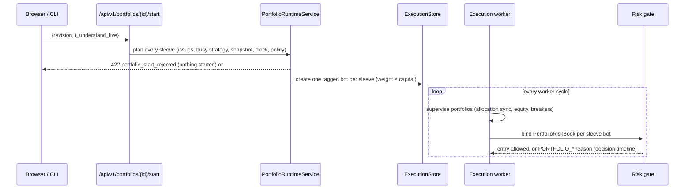

# Portfolios

Decision records: [ADR 0088](../decisions/0088-portfolio-model-and-portfolio-backtest.md)
(model and backtests) and [ADR 0091](../decisions/0091-portfolio-deployment-limits-and-manager-proposals.md)
(deployment, portfolio limits, manager proposals). This page maps the code and data flow; the ADRs
own the semantics.

## Modules

| Module | Role |
|---|---|
| `thytrader.portfolios.models` | Domain records (`Portfolio`, `Sleeve`, `SleeveStrategy`, `JournalEntry`), validated decimal value types, request commands, errors |
| `thytrader.portfolios.rules` | Pure planning: every mutation becomes a `MutationPlan` (next row at revision + 1, full next sleeve set, journal entries); allocation summary |
| `thytrader.portfolios.store` | `PortfolioStore` / `PortfolioBacktestStore` protocols, in-memory (tests) and disabled (no database) stores |
| `thytrader.persistence.postgres_portfolio_rows` | In-transaction row mapping, plan application, and the strategy-deletion hook (no backtest imports, so `postgres_strategies` can call it) |
| `thytrader.persistence.postgres_portfolios` | `PostgresPortfolioStore`: transactions, row locks, revision-guarded writes, job queue, canonical results |
| `thytrader.portfolios.planning` | Snapshot sleeves, bind datasets, resolve and intersect windows (`backtest.submission.resolve_backtest_window`) |
| `thytrader.portfolios.jobs` | `PortfolioBacktestRunner` in the research worker ([ADR 0092](../decisions/0092-research-worker-pool.md)): run children through `BacktestSubmitter`, combine off the event loop |
| `thytrader.portfolios.combine` | Union grid, forward fill, drawdown, idle capital, correlation, overlap, equal-weight basket |
| `thytrader.portfolios.backtest` | Request, plan, result, listing, and job contracts; canonical bytes and fingerprint |
| `thytrader.portfolios.views` | HTTP response models shared by the routes and the CLI |
| `thytrader.api.routes.portfolios` | `/api/v1/portfolios` |
| `thytrader.portfolios.cli` / `client` | `thytrader-portfolio` lane |
| `thytrader.operator.portfolios_report` | Operator report kind `portfolios` (deployment state, breaker, pending proposals) |
| `thytrader.portfolios.deployment` | Pure deployment rules: sleeve books, state, run equity, baselines, breaker trips, the gate's `PortfolioRiskBook` |
| `thytrader.portfolios.runtime` | `PortfolioRuntimeService`: plan and start one bot per sleeve, pause/resume/stop (portfolio or sleeve), breaker reset, journal and audit |
| `thytrader.portfolios.proposals` / `manager` | Proposal contracts, auto-apply bounds, and `ProposalService` (submit, approve, decline, expiry) |
| `thytrader.portfolios.briefing` / `runtime_views` | The manager briefing and the deployment/proposal HTTP views |
| `thytrader.persistence.postgres_portfolio_runtime` | Runtime-state compare-and-set, proposal rows, the weekly auto-apply budget query |
| `thytrader.execution_worker.portfolio_supervisor` | Per-cycle supervision: allocation sync, equity baselines, breaker trips and replays |
| `thytrader.risk.gate` (`evaluate_portfolio_entry`) / `risk.portfolio_scope` | Portfolio caps and latch in the entry gate; the fail-closed per-deployment scope |
| `thytrader.api.routes.portfolio_runtime` | `/api/v1/portfolios/{id}/deployment`, `start`/`pause`/`resume`/`stop`, sleeve actions, `breaker/reset`, `proposals`, `briefing` |
| `thytrader.runtime_control.portfolio_commands` / `portfolios.manager_cli` | `thytrader-runtime portfolio-*` and the `thytrader-portfolio` manager commands |

## Tables (Alembic 0054 and 0056)

`portfolios` (one row, `revision > 0`, mode/quote CHECKs), `portfolio_sleeves` (FK to portfolios
and strategies, both `ON DELETE CASCADE`; unique `(portfolio_id, strategy_id)`),
`portfolio_journal_entries` (append-only; `sequence` gives append order),
`portfolio_backtest_jobs` (queue; plan JSON payload; lease columns from Alembic 0057), `published_portfolio_backtests` (canonical
result JSON plus a listing row). Decimals are canonical text with format CHECKs.

Alembic 0056 adds `deployments.portfolio_id` (FK `ON DELETE SET NULL`, partial index; set at
creation, excluded from runtime UPDATEs), `portfolio_runtime` (one row per deployed portfolio: run
start, breaker latch, day-open / high-water / last equity, a compare-and-set `revision`), and
`portfolio_proposals` (kind, status, rationale, change and evidence JSON, base revision, approval
reason, weight moved, decision columns), and widens the journal kinds.

## Deployment and supervision flow



A tripped stop latches in `portfolio_runtime`, pauses every running sleeve, and journals
`breaker_tripped`; the reset is an operator call that compare-and-sets the cleared, re-baselined
row. Proposals are written with their settlement in one transaction (the portfolio row is locked,
the weekly auto-apply budget is read under that lock); pause/resume settlements run the runtime
action first and then record the outcome.

## Mutation flow

```mermaid
sequenceDiagram
  participant Client as Browser / CLI
  participant API as /api/v1/portfolios
  participant Store as PostgresPortfolioStore
  participant DB as PostgreSQL
  Client->>API: PUT /weights {revision, weights}
  API->>Store: set_weights(request, context)
  Store->>DB: BEGIN; SELECT portfolio FOR UPDATE; sleeves + strategy facts
  Store->>Store: plan_set_weights (revision check, weights + reserve <= 1)
  Store->>DB: UPDATE portfolio WHERE revision = N; sleeve diff; INSERT journal; COMMIT
  API-->>Client: portfolio at revision N + 1 (or 409 / 422)
```

Adding a sleeve locks the strategy row (`FOR SHARE`) before the portfolio row; strategy deletion
locks the strategy row (`FOR UPDATE`) and then each portfolio in `portfolio_id` order, journals
`sleeve_removed`, and only then deletes the strategy.

## Backtest flow

`POST /backtests` plans synchronously (422 `portfolio_backtest_rejected` on any sleeve problem)
and queues the plan. A research worker process claims the job under a lease (ADR 0092), submits
each dated child request (published and deduplicated like any backtest), reloads the verified child
results, loads the basket candles from the finest-clock sleeve per primary product, combines,
stores the canonical result, journals `backtest_run`, and completes the job. Portfolio backtests
share the research worker pool with backtests and studies, so `THYTRADER_RESEARCH_WORKER_COUNT`
bounds how many run at once. A job whose worker died is re-queued after its lease expires; jobs
expire after 24 hours.
